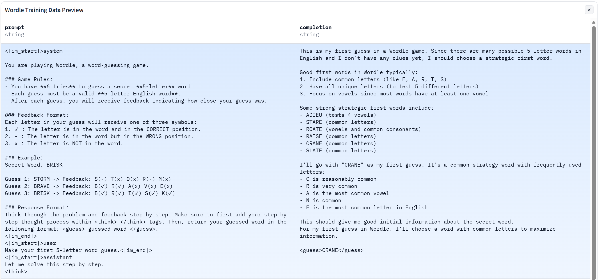
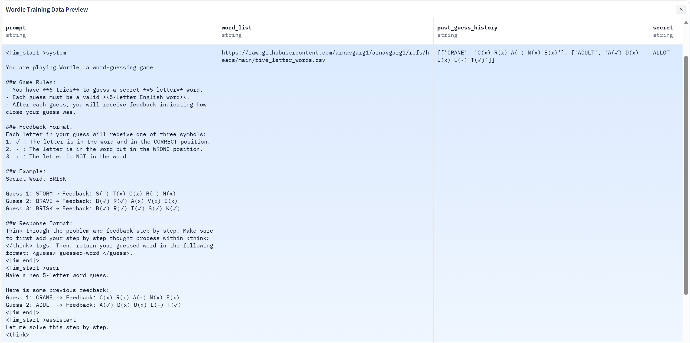

# Wordle：基于SFT 与 GRPO 的策略对齐

本仓库是一个迷你 LLM 微调项目，基于 **Qwen 2.5 7B Instruct** 和 **Predibase** 平台，对语言模型进行 Wordle （一种猜词游戏）的监督微调（SFT）与生成式奖励策略优化（GRPO）。通过这套核心架构，模型不仅能学习基础的猜测格式，还能通过强化学习机制在游戏尝试中获取奖励与惩罚，主动进化出高效解题的能力。

## 项目结构
```text
.
├── main.py                 # 项目统一 CLI 主入口
├── train/                  # 训练相关任务下发
│   ├── sft.py              # SFT（监督微调）
│   ├── grpo.py             # 纯 GRPO 训练
│   └── sftgrpo.py          # 混合训练（在 SFT 检查点上继续 GRPO）
├── eval/
│   └── evaluate.py         # 评估脚本，预测并在 Wordle 环境中算分
└── src/
    ├── data/
    │   └── loader.py       # 加载 HuggingFace 数据集到 Predibase
    ├── rewards/            # GRPO 强化的奖励函数群
    │   ├── format.py       # XML 响应格式奖励校验
    │   ├── feedback.py     # Wordle 游戏规则与反馈推断校验
    │   └── entropy.py      # （信息增益）探索与减少解空间不确定性的高级激励
    └── utils/
        └── config.py       # 配置拉取（如平台 API 密匙）
```
## Instruct/Base

本项目选择基于 Qwen2.5-7B-Instruct 进行微调，主要是为了利用其原生具备的指令遵循与多轮对话能力。相比 Base 版本，Instruct 模型已经完成了对话格式的对齐训练，能天然识别系统提示词并维持稳定的对话模式。所以 SFT 阶段可以直接聚焦在 Wordle 的策略逻辑与格式规范上，而不用额外耗费数据去教模型“如何做一个合格的对话助手”，提升训练效率。

通常只有在拥有海量行业私有数据（如医疗、法律）、需要支持全新语言，或想要彻底摆脱“AI 助手”语气干扰的场景下，才会优先考虑 Base 模型。Base 模型仅具备最原始的文本接龙能力，不带任何预设的对话偏好，适合需要从底层逻辑开始重塑模型行为，或打造高度自定义风格（非标准对话逻辑）的重度定制任务。

## 数据集与训练

### 1. 带有 Few-shot 示例注入的 SFT 策略



我们通过 SFT 为模型构建了“先思考、后输出”的行为模式：利用结构化标签定义输出规范，解决了解析难题；通过思维链训练，赋予模型解析 Wordle 反馈并进行逻辑推导的能力。然后，微调过程严控了游戏规则约束（如词长、反馈对齐），显著降低了模型幻觉。最终，模型从发散的通用 AI 进化为具备深度策略意识的 Wordle 游戏专家。

### 2. 集成多维奖励函数反馈的 GRPO 策略优化



在 SFT 奠定的基础上，我们利用 **GRPO（组相对策略优化）** 让模型从“死记硬背”转向“实战博弈”。这一阶段不再提供标准答案（模型看不到secret），而是通过设置格式校验、逻辑一致性以及信息熵等奖励函数，引导模型在自主生成中优化猜测路径。通过对同一 Prompt 下的多组回答进行群体相对评分，模型学会了在思考过程中主动核对历史反馈，动态剔除逻辑矛盾。

## 实验结果

| 模型方案 | 成功通关数 (10 局制) | 获胜组内平均猜词数 |
| :--- | :---: | :---: |
| Baseline | 0 | 6 |
| 单 GRPO | 3 | 4 |
| **SFT + GRPO** | **7** | **4** |

在 10 局随机测试中，Qwen 2.5 7B Instruct (Baseline) 因格式偏离和逻辑幻觉导致成功通关数为 0，平均猜测数达到满额的 6 次；纯 GRPO 模式虽将获胜组内平均猜测数优化至 4 次，但由于缺乏基础格式对齐，成功率仅为 3/10；而最终采用 SFT + GRPO 方案的模型在保持 4 次平均猜测数的高效逻辑下，成功通关数提升至 7/10，验证了先通过 SFT 规范输出格式、再通过 GRPO 强化博弈策略的二阶段微调路径在处理此类强约束逻辑任务时的显著优势。
